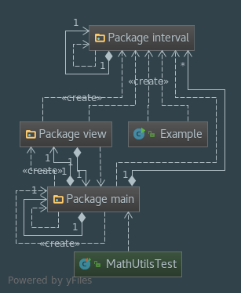

# Intervallic
A simple cross-platform repeating interval

## Version 2!
* Complete rewrite of Intervallic
* Completely new interface

## Version 2 Features
1. Multiple Intervals
    * Each Interval runs in its own thread
    * Intervals can be made on after the other, or multiple at once
2. Progress bar
    * Text-based progress bar, representing progress to the next interval reset
    
## Techniques used
* Reset and Tick Listeners
    * Interfaces used with Interval to implement strategy pattern
    * Alternatively these interfaces can be done through lambdas by the client
* Dividing classes into seperate packages
    * Interval has been encapsulated into its own package, and is available in my Interval repo now.

---

## Version 1 Features
1. Slider to set and monitor intervals
2. Intervals repeat at a regular pace

### Techniques used
* Strategy pattern used to handle what interval does when it resets
* MVC pattern implemented with View.View interface to add additional Forms in Version 2

