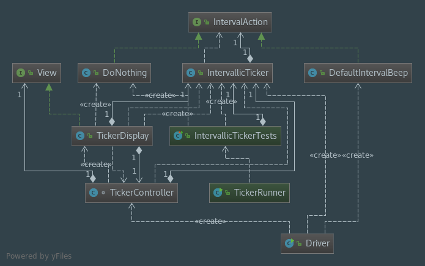

# Intervallic
A simple cross-platform repeating timer

## Version 1 Features
1. Slider to set and monitor intervals
2. Intervals repeat at a regular pace

### Techniques used
* Strategy pattern used to handle what timer does when it resets
* MVC pattern implemented with View interface to add additional Forms in Version 2

